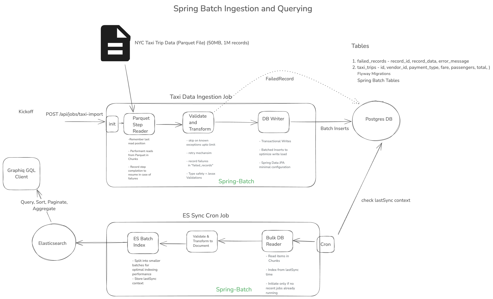

# Taxi Data Pipeline

## Overview
This project is a data pipeline for processing and analyzing New York City Yellow taxi trip data, leveraging Spring Batch, PostgreSQL, Elasticsearch, and GraphQL technologies.

## Data Sources
- Sample data: `data/yellow_tripdata_2024-01.parquet` (1.08 Million records)
- Data dictionary: `data_dictionary_trip_records_yellow.pdf`

## Architecture
Expand `docs/architecture_diag.png`



## Prerequisites
Before running the project, ensure you have the following installed:
- Java Development Kit (JDK) 17 or higher
- Docker and Docker Compose

## Project Components
- Parquet file Batched Ingestion 
- Batch data processing
- Elasticsearch indexing
- GraphQL query interface

## Quick Start

### Running the Application
The project includes a convenient `run.sh` script for easy deployment. It starts up the docker containers:

```bash
# Make the script executable
chmod +x run.sh

# Execute the script to start up Postgres, Elasticsearch and Kibana containers 
./run.sh

# Run the application
./mvnw clean spring-boot:run
```

This will:
- Start required Docker services
- Build the application
- Launch the data pipeline

### Manual Build and Run
Alternatively, you can use Maven:

```bash
# Clean and compile
mvn clean package

# Run the application
java -jar target/taxi-data-pipeline-1.0-SNAPSHOT.jar
```

## Testing

### Running Tests
Execute the test suite using Maven:

```bash
./mvnw test
```

## GraphQL Queries
The application exposes a GraphQL endpoint for querying trip data. Refer to `src/main/resources/graphql/schema.graphqls` for the complete schema.

